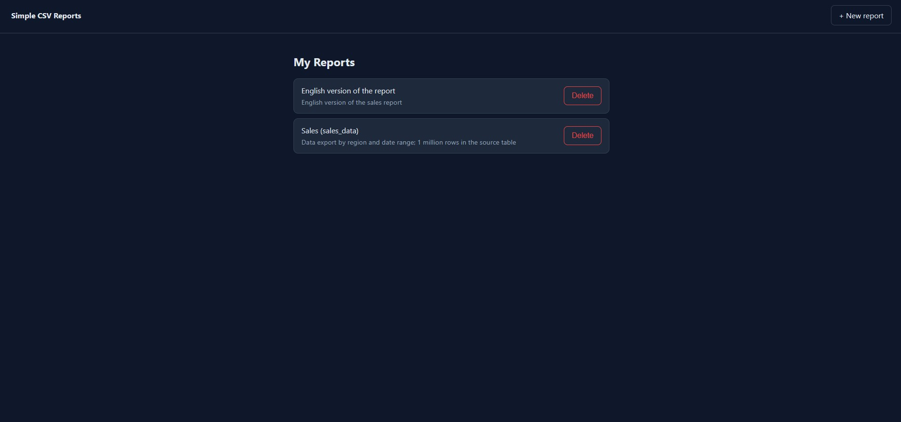
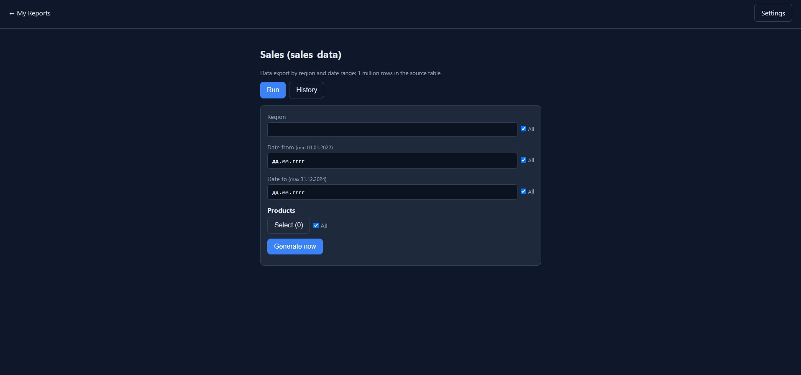
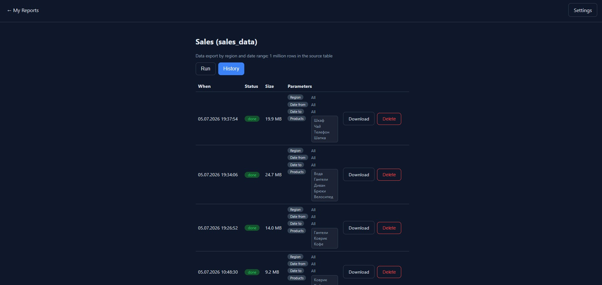
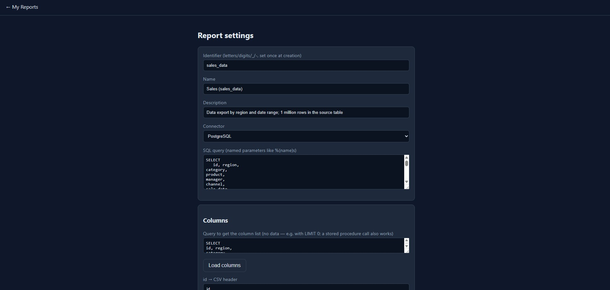

# NoTimeoutCSV

**Simple CSV reports** — parameterized SQL reports with background export to CSV, without volume limits and without the risk of hitting a web server timeout. Each run is a separate process: generation can take hours or days without blocking the server. The run history is not cleaned up automatically — you can always compare it with what was there yesterday.

Live demo (with static examples, without a real database): **https://windowrepino.ru/notimeoutcsv/index.html**

Video: How it works **https://youtu.be/6V1Tl244W3Q**

## Screenshots

| Report list | Run parameters |
|---|---|
|  |  |

| Export history | Report builder |
|---|---|
|  |  |

## Quick start

For the application to work correctly, you need to create and fill in the .env file. You can simply rename .env.example and enter your own values.

```
cd server
pip install -r requirements.txt
cp .env.example .env   # enter your DB settings
python server.py
```

Open `http://127.0.0.1:8000` — the client is served by the same process, there is no need to start anything separately.

## Via npm

```
npm install no-timeout-csv
python node_modules/no-timeout-csv/server/server.py
```

(Node is used here only as a way to deliver files to disk — the server itself is written in Python, and `node` is not needed for it to work.)

When installing via npm, it is worth setting `CONFIGS_DIR`/`RESULTS_DIR` in `.env` to a path **outside** `node_modules` right away.

### Keeping your config outside `node_modules`

`npm install` puts both `server/.env` and `client/js/config.js` inside `node_modules`, which gets wiped on every reinstall. Keep your config elsewhere with two optional flags:

```
python node_modules/no-timeout-csv/server/server.py \
  --server-config /path/to/your/server.env \
  --client-config /path/to/your/config.js
```

Both flags are optional and independent of each other — pass either one, both, or neither (falls back to the bundled files).

Note: an OS-level environment variable always wins over a value from `.env` (same default behavior as `python-dotenv`). If a setting seems to be ignored despite a correct `--server-config` file, check whether `CONFIGS_DIR`/`RESULTS_DIR` (or any other key) is already set in your shell session from an earlier test — a leftover `set CONFIGS_DIR=...` will silently override the file every time.

## Settings — two separate files

The server and the client are not one process, but two independent parts that do not read each other’s settings. That is why there are two settings files:

- **`server/.env`** — everything the server needs: DB connection, `MAX_WORKERS`, `PORT`, `HOST`, `CONFIGS_DIR`/`RESULTS_DIR`, `CSV_DELIMITER`, `HELPER_TIMEOUT_SECONDS`, language of server messages. The full and always up-to-date list is in `server/.env.example`.
- **`client/js/config.js`** — what the browser needs: interface language, history polling intervals. This is a regular static JS file, served to the browser as is, without any processing by the server.

Both are edited manually, with a simple text editor, without rebuilding — just like everything else in the project.

## Structure

- `server/` — Python, standard library except for the DB connector
  - `server.py` — HTTP API + worker orchestrator, does not work with the DB
  - `worker.py` — a separate process for each report run, writes CSV
  - `param_options.py` — short-lived process: options for list/multiselect, min/max hints for dates
  - `report_columns.py` — short-lived process: list of columns for the report builder
  - `connectors/` — DB connection plugins, example: `postgresql.py`
  - `configs/` — report configs: SQL query, parameters, column mapping
  - `results/` — finished files are accumulated here, one per run
- `client/` — pure JS, without build tools and frameworks
  - `index.html` — report list
  - `report.html` — report launch and export history
  - `settings.html` — creating/editing a report: SQL, columns, parameters

## Interface language

By default — Russian. It is switched in two places separately: the client and the server do not read each other’s settings.

- **Client** — `LANGUAGE: "ru"` / `"en"` in `client/js/config.js`.
- **Server** — `LANGUAGE=ru` / `en` in `server/.env`.

## How to add/configure a report

There is already a ready-made example in `server/configs/` — **`sales_data`**. It shows everything at once in practice: regular parameters (`region`), dates with min/max hints (`date_from`/`date_to`), multiselect (`products`), and `column_mapping` for CSV headers. It is convenient to open it in "Settings" just to see how all this is put together before writing your own. Keep in mind: the example itself refers to the `sales_data` table, which most likely does not exist in your database — this is a sample config structure, not a demo dataset ready to run.

The easiest way is through the interface: **"+ New report"** on the main page, or **"Settings"** on the page of an existing report. The form lets you set the name, SQL query, columns, and parameters; there is no need to edit anything in files manually.

If desired, the config can also be written/edited by hand — it is just `.json` in `server/configs/`, no magic:

```json
{
  "id": "my_report",
  "name": "Name",
  "connector": "postgresql",
  "sql": "SELECT ... WHERE col = %(param)s",
  "columns_query": "SELECT * FROM my_table LIMIT 0",
  "column_mapping": {"col": "Column"},
  "params": [{"name": "param", "view_name": "Parameter", "type": "string"}]
}
```

### Deleting a report

The "Delete" button next to each report in the general list (`index.html`) first asks for confirmation, in case of an accidental click, and after that deletes **everything at once and irreversibly**: both the config itself (`configs/<id>.json`) and the entire folder with the accumulated export history (`results/<id>/`). There is no partial deletion, for example only the config but not the files.

### How parameters actually get into the query

`%(name)s` is a psycopg2 placeholder: named, safe from SQL injections. The value is passed to the driver separately from the query text and is not substituted as a string. The name inside the parentheses must **exactly** match the "Variable name" field of the parameter in the settings, including case.

**Important:** a parameter from the "Parameters" list is only a description for the form: what field to show the user, what type it is, where to get options for the list from. By itself, it does not affect anything until you write `%(name)s` somewhere in the SQL query text. If you added the `region` parameter in the settings, but there is no `%(region)s` anywhere in the SQL, the user will see the "Region" field on the screen and select something there, but the query will run **as if this field did not exist**: psycopg2 simply does not find a place for this value in the query text and silently ignores it, with no error. In other words: the list of parameters describes the form, and `%(name)s` in SQL is what actually does something.

### Parameter not filled in ("All")

If the user leaves the parameter as "All" — did not enter a value or did not select anything — the server passes a real SQL `NULL` into the query. The standard way to make a filter optional is to write the condition together with a `NULL` check, wrapping the **entire** block in parentheses:

```sql
WHERE (%(region)s IS NULL OR region = %(region)s)
  AND (%(revenue)s IS NULL OR revenue >= %(revenue)s)
```

Parentheses around each block are required — `AND` in SQL binds more tightly than `OR`, and without parentheses `... AND %(x)s IS NULL OR revenue >= %(x)s` will be parsed not as expected: the second condition will “fall out” from under the other filters.

For multiselect (`type: "multilist"`), the parameter comes as a list — use `= ANY(%(name)s::text[])`; choose the array type to match your column, for non-text types, for example `::int[]`.

### Parameter types

- `string`, `number`, `date` — regular input field.
- `date` can additionally have `min_query`/`max_query` — SQL with one column and one value, the result of which is shown as a hint next to the field name, for example "Date from (min. 20.05.2022)". This is only a hint, not a restriction — it is still possible to select an earlier date.
- `multilist` — multiselect with search, requires `list_query` — SQL returning options: 1st column is the value, 2nd optional column is the label.

If an SQL operation needs to know the `NULL` type explicitly, for example `%(date)s + interval '1 day'`, where addition with an interval is ambiguous for an untyped `NULL`, add an explicit cast: `%(date)s::timestamp`. For simple comparisons (`=`, `>=`, `<=`) this is usually not needed — the type is already inferred unambiguously from the column type.

### Columns

`columns_query` is a separate SQL query, for example the same main query with `LIMIT 0`, or a stored procedure call. It is executed in the settings by the "Load columns" button and returns a list of names without data. Then each column is assigned its own name for the CSV header — this is `column_mapping`. Both fields are optional: without them, the CSV simply uses raw column names from the DB as they are.

## Your own connector to another DB

You can create your own connector to any DB, not only PostgreSQL. It is enough to write your own file in `server/connectors/`, with `NAME` and the function `stream_query(query, params) -> (columns, rows)` — see `postgresql.py` as an example.

## License

Free for personal, educational, and non-commercial use — see [LICENSE](./LICENSE).

For commercial use, a separate license is required — see [LICENSE.commercial](./LICENSE.commercial) or write to **korolevalexa@gmail.com**.
